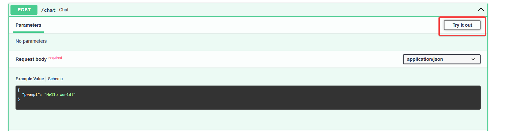

# Media Finder AI

Media Finder is an intelligent, AI-powered platform that helps you discover movies and games faster. It combines the power of Retrieval-Augmented Generation (RAG), computer vision, and a modern user interface to centralize your entertainment choices and reviews in one place.

## 🚀 Getting Started

### 1. Prerequisites
- Python 3.9+
- An API key from [Cohere AI](https://cohere.ai)

### 2. Installation
1.  **Clone the repository:**
    ```bash
    git clone https://github.com/{your_username}/Dauphine_2425.git
    cd Dauphine_2425
    ```

2.  **Create and activate a virtual environment:**
    ```bash
    # For macOS/Linux
    python3 -m venv venv
    source venv/bin/activate

    # For Windows
    python -m venv venv
    venv\Scripts\activate
    ```

3.  **Install dependencies:**
    ```bash
    pip install -r requirements.txt
    ```

4.  **Set up your environment variables:**
    - Create a `.env` file in the root of the project.
    - Add your Cohere API key to it:
      ```
      COHERE_API_KEY="YOUR_API_KEY_HERE"
      ```

### 3. Running the Application
To run the full application, including the Streamlit frontend and backend services, execute:
```bash
python main.py
```
This script will:
1.  Initialize the RAG system.
2.  Pre-compute and index embeddings if they don't exist (this might take a few minutes on the first run).
3.  Start the backend services.
4.  Launch the Streamlit web application.

Your browser should open to `http://localhost:8501`.

## 🏗️ Architecture Overview

This project is built using a **Hexagonal (Ports and Adapters) Architecture** to ensure a clean separation of concerns between the core application logic, external services, and the user interface.

-   **`domain/`**: Contains the core business logic, models, and ports (interfaces). This layer is independent of any specific technology.
-   **`application/`**: Orchestrates the domain logic and acts as a bridge to the infrastructure layer.
-   **`infrastructure/`**: Contains concrete implementations (adapters) for external services like the vector database (ChromaDB), text generation (Cohere), and graph database (Neo4j).
-   **`web_app/`**: The Streamlit user interface, which interacts with the application layer.

### RAG System
The Retrieval-Augmented Generation (RAG) system uses a combination of technologies:
-   **Vector Database**: `ChromaDB` for storing and querying text and visual embeddings.
-   **Text Embeddings**: `Sentence-Transformers` to convert media descriptions into vectors.
-   **Visual Embeddings**: `CLIP` for understanding the content of movie/game posters.
-   **Language Model**: `Cohere` for generating natural language responses based on retrieved context.

## 🔧 Scripts

-   **`scripts/split_data.py`**: Processes raw data into smaller, manageable chunks for faster loading and indexing.
-   **`scripts/optimize_rag.py`**: Pre-computes and indexes all embeddings for the full dataset. Run this script once to ensure the best performance.
    ```bash
    python scripts/optimize_rag.py
    ```
-   **`setup_neo4j.py`**: (Optional) Sets up the Neo4j graph database with sample users, content, and reviews for the Community features.

---

## Cohere & FastAPI

Follow the steps below to set up your environment, run the provided scripts, and build your own API and graphical interface using Streamlit.

### 1. Obtain a Cohere API Key

- At the root of the project, copy `.env.template` and rename it as `.env`.
- Visit the [Cohere website](https://cohere.ai) and sign up for an API key.
- Once obtained, store this API key in your copy of the `.env` file.

### 2. Play with Cohere through a FastAPI server

To start the FastAPI server, run the following command:

```bash
uvicorn rest.api:rest_api
```

You can interact with your API using SwaggerUI, which is automatically provided by FastAPI, or using a tool like Postman.

Access SwaggerUI by navigating to [http://127.0.0.1:8000/docs](http://127.0.0.1:8000/docs).

You can then try the chat endpoint using the "Try it out!" button and replacing the text in the _prompt_ field.



### 3. Use Cohere within Streamlit

At the root of this folder, ``main.py`` can be used to launch both the Streamlit and the FastAPI servers.

```bash
python ./main.py
```

Then, by going to the "Chat with Cohere" tab, you can start asking questions to Cohere!

## Your turn to play!

Using the current project architecture, create a new service to handle the history of messages. This service should be able to:
- retrieve an history
- store an history (JSON?)

You'll be able to give this history to Cohere to give more context to your conversation (see [cohere API documentation](https://docs.cohere.com/v1/reference/chat#request.body.chat_history)).

Going further, what if we were able to give Cohere some documents to generate a more appropriate answer? You can freely use the datas in [assets](./assets/dataset).

## Special thanks

A special thanks to William Hoareau for his work on a project that served as the foundation for my initial commit

